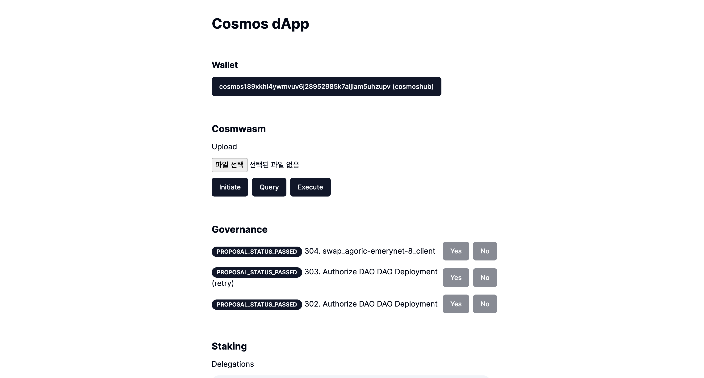

# Cosmwasm

Cosmwasm은 Cosmos-SDK에서 Smart Contracts를 사용하기 위한 프로젝트 중 하나이다.

`x/wasm` 모듈을 통해 코드, 컨트랙, 컨트랙 state 관리, wasmvm 등 기능을 한다.

이 미션을 통해 Cosmwasm 코드 / 컨트랙트 구조와 쿼리, 실행을 알아본다.

## 사전 준비

Cosmos-SDK의 Cosmwasm은 evm의 스마트 컨트랙트와 약간의 다른점이 있다.

[Code](https://www.mintscan.io/neutron/wasm?sector=code)와 [Contract](https://www.mintscan.io/neutron/wasm/code/491)가 나누어져 있는데, 코드를 먼저 배포하고 해당 코드를 initiate하여 contract를 배포할 수 있는 구조이다.

Cosmwasm 코드 및 컨트랙트 업로드, initiate를 권한을 통해 관리할 수 있다.

- Code 업로드를 거버넌스를 통해서만 올리게 할 수 있다.
- Code를 특정한 사람만 Initiate 할 수 있다.
- Public하게 Code / Contract를 생성 할 수 있다.

우리는 Public Contract 체인인 Neutron Testnet 기반으로 미션을 진행한다.

Cosmwasm에서 컨트랙을 개발하는 것을 배운 상태이므로,
이미 구현된 code를 배포, initiate, query, execute 하는 것을 배워보도록 한다.

## 구현

Cosmoshub는 Cosmwasm이 지원되지 않는 체인이기 때문에, Neutron 체인에서 테스트 한다.

기존에 getSigningClient 였던 client 훅도 wasm 전용인 getSigningCosmWasmClient로 변경하여 client를 생성한다.

```ts
const { address, getSigningCosmWasmClient } = useChain("neutrontestnet");
```

### Code Upload

Cosmwasm의 cw-plus(https://github.com/CosmWasm/cw-plus/)에 ERC20과 같은 프로젝트인 cw20-base 컨트랙트를 배포 해본다. [cw20_base.wasm](../../files/cw20_base.wasm)

```ts
const upload = async (uploadCode: Uint8Array) => {
  if (!address || !uploadCode) {
    return;
  }

  const client = await getSigningCosmWasmClient();
  const code = await client.upload(address, uploadCode, "auto");
  console.log(code);
};

<input
  type="file"
  placeholder="Amount"
  onChange={(e) => {
    const file = e.target.files?.item(0);
    if (file) {
      file.arrayBuffer().then((buff) => {
        upload(new Uint8Array(buff));
      });
      console.log("call finished");
    }
  }}
/>;
```

### Initiate

업로드 된 코드의 아이디를 확인한다.

https://neutron.celat.one/pion-1/codes/5541/schema

해당 Code의 Schema 정보를 확인하여 initiate 한다.
(Schema 관련 정보는 코슴와즘 관련 내용 참고)

```ts
const client = await getSigningCosmWasmClient();
const init = await client.instantiate(
  address,
  5541,
  {
    decimals: 2,
    initial_balances: [{ address: address, amount: "1000000" }],
    name: "CW20 TEST",
    symbol: "aCW",
  },
  "CW20 TEST",
  "auto"
);
console.log(init);
const contractAddress = init.contractAddress;
```

위 initiate를 통해 cw20 토큰 contract가 생성되고, initial_balances에 있는 정보로 토큰이 할당 되게 된다.

### Query

생성된 contractAddress정보를 통해 query, execute를 해본다.

contract에 쿼리를 하기 위해선 Query를 위한 schema 정보를 확인하여 해당 스펙에 맞게 구조를 만들어 호출하여 조회한다.

아래는 cw20의 토큰 밸런스를 조회하는 `{ balance: { address: address } }` smart 쿼리를 호출 하는 예제이다.

```ts
const client = await getSigningCosmWasmClient();
const query = await client.queryContractSmart(contractAddress, {
  balance: { address: address },
});
console.log(query);
```

### Execute

Execute는 이더리움의 call과 같은 기능으로 트랜잭션을 컨트랙으로 보내는 기능이다.

아래는 cw20 100 토큰을 전송하는 예제로 다른 execute를 하기 위해서는 schema 정보를 확인한다.

```ts
const client = await getSigningCosmWasmClient();
const execute = await client.execute(
  address,
  contractAddress,
  { transfer: { recipient: address, amount: "100" } },
  "auto"
);
console.log(execute);
```

### 미션 적용

위 내용들을 구현한 예제를 통해 Cosmwasm 구동 방식을 이해해본다.

#### **`components/wasm.tsx`**

```ts
"use client";

import { useChain } from "@cosmos-kit/react";
import { Button } from "./ui/button";
import { useState } from "react";

export default function Wasm() {
  const { address, getSigningCosmWasmClient } = useChain("neutrontestnet");
  const [contractAddress, setContractAddress] = useState("");

  const upload = async (uploadCode: Uint8Array) => {
    if (!address || !uploadCode) {
      return;
    }

    const client = await getSigningCosmWasmClient();
    const code = await client.upload(address, uploadCode, "auto");
    console.log(code);
  };

  const initiate = async () => {
    if (!address) {
      return;
    }

    const client = await getSigningCosmWasmClient();
    const init = await client.instantiate(
      address,
      5541,
      {
        decimals: 2,
        initial_balances: [{ address: address, amount: "1000000" }],
        name: "CW20 TEST",
        symbol: "CWT",
      },
      "CW20 TEST",
      "auto"
    );
    console.log(init);
    setContractAddress(init.contractAddress);
  };

  const query = async () => {
    if (!address) {
      return;
    }

    const client = await getSigningCosmWasmClient();
    const query = await client.queryContractSmart(contractAddress, {
      balance: { address: address },
    });
    console.log(query);
  };

  const execute = async () => {
    if (!address) {
      return;
    }

    const client = await getSigningCosmWasmClient();
    const execute = await client.execute(
      address,
      contractAddress,
      { transfer: { recipient: address, amount: "100" } },
      "auto"
    );
    console.log(execute);
  };

  return (
    <div className="space-y-3">
      <h3 className="text-xl font-bold">Cosmwasm</h3>
      <h4 className="text-md">Upload</h4>
      <input
        type="file"
        placeholder="Amount"
        onChange={(e) => {
          const file = e.target.files?.item(0);
          if (file) {
            file.arrayBuffer().then((buff) => {
              upload(new Uint8Array(buff));
            });
            console.log("call finished");
          }
        }}
      />
      <div className="space-x-2 flex">
        <Button onClick={initiate}>Initiate</Button>
        <Button onClick={query}>Query</Button>
        <Button onClick={execute}>Execute</Button>
      </div>
    </div>
  );
}
```

#### **`app/pages.tsx`**

```ts
import Balance from "@/components/balance";
import Gov from "@/components/gov";
import IbcSend from "@/components/ibc-send";
import Send from "@/components/send";
import Staking from "@/components/staking";
import Wallet from "@/components/wallet";
import Wasm from "@/components/wasm";

export default function Home() {
  return (
    <main>
      <div className="m-10 grid gap-14 w-2/5 mx-auto">
        <h1 className="text-3xl font-bold">Cosmos dApp</h1>
        <Wallet />
        <Wasm />
        <Gov />
        <Staking />
        <IbcSend />
        <Send />
        <Balance />
      </div>
    </main>
  );
}
```

## 결과


