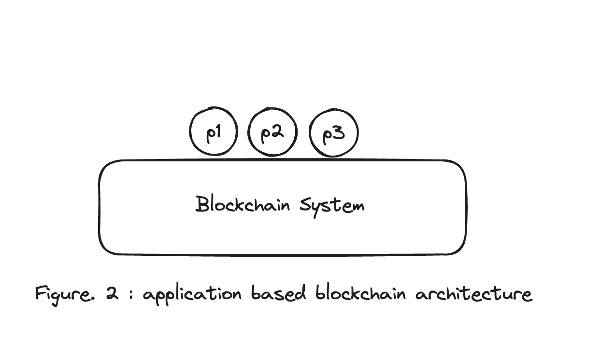
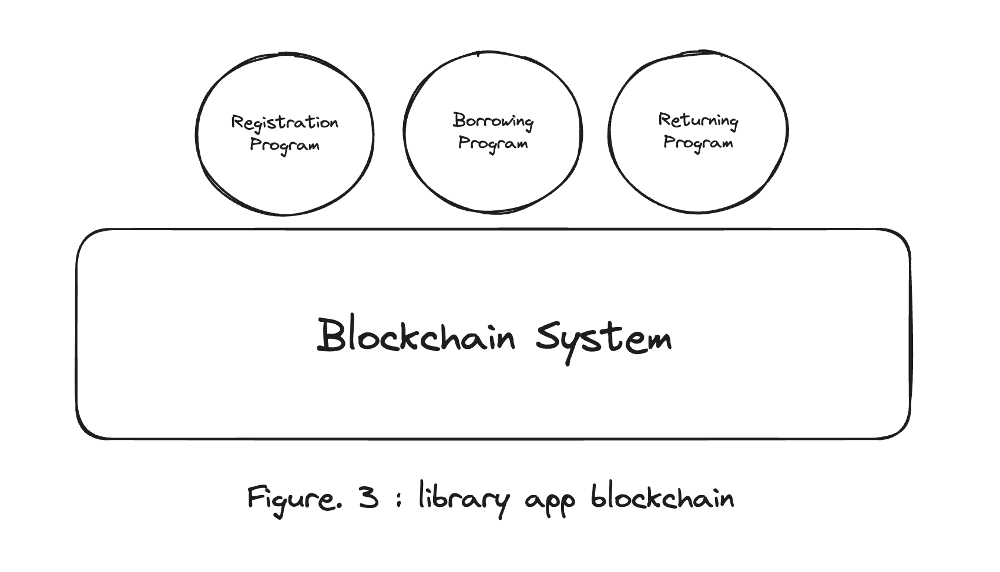

# 02. Understand app chain architecture

### Preview

**Hello World!**, 안녕하세요! 코스모스 베이직 과정 두번째 챕터에 오신 걸 환영합니다!

두번째로 우리가 다룰 주제는 **'앱 체인 아키텍쳐 이해하기'** 입니다.

지난 시간에는 왜 app specific chain이라는 컨셉이 등장했는지 공감하고 이해하는 시간을 가졌습니다.

이어서 저희는 이번 과정에서 그 앱 체인(app specific chain)이 어떻게 구성되어있는지 Cosmos-SDK 기반으로 알아보겠습니다.

---

### What are application-specific blockchains

Cosmos-SDK!? 가 무엇인지 살펴보기 전에 저는 먼저 app specific chain이 어떤 느낌인지 다시 한번 살펴보고자 합니다.

제가 참고한 cosmos sdk official docs에서는 아래와 같이 설명되어있습니다만!

> Application-specific blockchains are blockchains customized to operate a single application. Instead of building a decentralized application on top of an underlying blockchain like Ethereum, developers build their own blockchain from the ground up. This means building a full-node client, a light-client, and all the necessary interfaces (CLI, REST, ...) to interact with the nodes.
> _(https://docs.cosmos.network/v0.50/learn/intro/why-app-specific)_

다소 헷갈릴 수 있게 표현되어있는 저 표현도 저희가 이미 지난 시간에 배웠던 예시와 그림들을 다시 본다면 좀 더 쉽게 이해하실 수 있습니다.



우린 지난시간에 도서관이란 시스템을 예로 앱 체인에 대해서 이야기 해봤었는데요. 이렇게 **도서관과 같이 하나의 어플리케이션만을 위한 블록체인이 바로 application-specific blockchain(app-specific chain, 이하 앱체인)입니다.**

공식문서에서는 single application. 이라고 표현되어있어서 그러면 하나의 프로그램만이 올라가있냐고 착각하실 수도 있는데 하나의 어플리케이션에는 여러 기능들이 존재할 수 있으니 하나의 서비스만을 위한 체인으로 생각하시면 됩니다.

계속해서 도서관이란 시스템을 예로 들어서 도서관에는 회원가입기능, 대출기능, 반납기능 등이 필요하다고 봅시다. (추가적인 기능들이 있겠지만은 생략)

그렇다면, '도서관 앱 체인'에는 다음과 같은 프로그램들이 올라갈 것입니다.

1. 회원가입 프로그램 (Registration Program)
2. 대출 프로그램 (Borrowing Program)
3. 반납 프로그램 (Returning Program)

그럼 위에서 보았던 application based blockchain 아키텍쳐를 예시로 든 '도서관 앱 체인'에 맞게 좀 더 구체적으로 표현해보겠습니다.



---

### Shortcut of application-specific blockchains

다시 한번 우리가 위에서 배운 내용을 짧게 요약한다면, 우리는 이제 이렇게 말할 수 있을 것입니다.

흔히 블록체인을 접하게 되면 가장 먼저 배우게 되는 VM based의 Ethereum(EVM)같이 general purpose를 위한 application blockchains이 아닌
(하나의 블록체인 위에 여러 어플리케이션을 올리려는 목적)

도서관 예시와 같이 이렇게 **하나의 어플리케이션(=서비스)를 위한 블록체인이 바로 application-specific blockchains이라고 이해하시면 되겠습니다.**

---

<!--
## 2. Why we need to use Cosmos SDK for building a app-chain？

Cosmos SDK is the most advanced framework built today by defining specific block chains of applications. The following are several reasons for considering the use of Cosmos SDK to construct a decentralized application：

The default consensus engine in Cosmos SDK isTendermint Core. Tendermint is the most existing （ and the only ） mature BFT consensus engine. It is widely used in the entire industry and is considered to be the golden standard consensus engine for building a pile certification system.
Cosmos SDK is open source, and its design purpose is to facilitate the construction of block chains from combustible modules. With the development of the open source Cosmos SDK module ecosystem, it will become easier and easier to build a complex de-centralized platform with it.
Cosmos SDK was inspired by function-based security and was inspired by years of struggle with block chain state machines. This makes Cosmos SDK a very safe environment for building block chains.
Most importantly, Cosmos SDK has been used to construct many application-specific block chains that have been put into production. Among them, we can quote Cosmos Hub, IRIS Hub, Binance Chain, Terra or Kava）.moreBased on Cosmos SDK construction.

---

## Benefits of block chains specific to applications

- flexibility

Cosmos SDK based Block chains for specific applications provide developers with maximum flexibility：

In the block chain of Cosmos, the state machine is usually calledABCIThe interface is connected to the bottom consensus engine. This interface can be packed in any programming language, which means that developers can use the programming language they choose to build their status machine.

ABCI also allows developers to exchange consensus engines for their specific application block chains. Today, only Tendermint can be put into production, but other consensus engines are expected to appear in the future.

-> ABCI 가 그래서 생각보다 재밌는 모델인데 이건 나중에 과제로 생각해보기 abci++

In Cosmos SDK, logic can be automatically triggered at the beginning and end of each block. They are also free to choose the encryption library used in the application, rather than the limitation of the content provided by the bottom environment in the case of the virtual machine block chain.

- performance

In order to optimize the performance of the decentralized application, it needs to be constructed as a block chain specific to the application.

- sovereignty

One of the main benefits of a particular application block chain is sovereignty. The decentralized application is an ecosystem that designs many participants: users, developers, third-party services, etc. When developers construct on many virtual machine block chains where decentralized applications coexist, the applied community is different from the community of the bottom block chain, which replaced the former in the governance process. If there is a bug or a new function is needed, the application stakeholders have very little room to upgrade the code. If the community at the bottom block chain refuses to take action, then nothing will happen.

-> tvl이 작은 체인대한, ICS 생겨난 이유도 설명

---

what is cosmos-sdk


이 그림을 반드시 이해야함. 매우 중요..

아! 여기선 굳이 컨센서스 레벨에 대해서는 건들지는 않을 거야. (오히려 공감하고 이해하는데 방해가 된다고 생각하거든)


```
                ^  +-------------------------------+  ^
                |  |                               |  |   Built with Cosmos SDK
                |  |  State-machine = Application  |  |
                |  |                               |  v
                |  +-------------------------------+
                |  |                               |  ^
Blockchain node |  |           Consensus           |  |
                |  |                               |  |
                |  +-------------------------------+  |   CometBFT
                |  |                               |  |
                |  |           Networking          |  |
                |  |                               |  |
                v  +-------------------------------+  v
```

              +---------------------+
              |                     |
              |     Application     |       -> Cosmos-SDK
              |                     |
              +--------+---+--------+
                       ^   |
                       |   | ABCI
                       |   v
              +--------+---+--------+
              |                     |
              |                     |
              |     Tendermint      |
              |                     |
              |                     |
              +---------------------+

https://youtu.be/1_ottIKPfI4?si=XstKA2YGi2-yYKzF


transaction Lifecycel.. -> 생략하자 ㄱ

sdk structure


## The main components of Cosmos SDK

#### 1. baseapp

-> simapp에서 공부

#### 2. Multistore

-> 대강하고 넘어가고

Multistore

Cosmos SDK provides a multi-store for persistence. Multi-storage allows developers to declare an arbitrary number of KVStores. These KVStores only accept [] bytes as values, so any custom structure needs to be marshalled using a coder before being stored.

Multi-storage abstract is used to divide the state into different blocks, each of which is managed by its own module.

디비파트임.

#### 3. module.. etc

기본적인 모듈이 있다.. 정도하고 5번에서 대체
module

The power of Cosmos SDK lies in its modularity. The Cosmos SDK application is built by aggregating a series of interoperable modules. Each module defines a subset of the state and contains its own message/transaction processor, and Cosmos SDK is responsible for routing each message to its own module.

The following is a simplified view of how each application at a complete node handles the transaction when it receives the transaction in a valid block：

```
                                      +
                                      |
                                      |  Transaction relayed from the full-node's
                                      |  Tendermint engine to the node's application
                                      |  via DeliverTx
                                      |
                                      |
                +---------------------v--------------------------+
                |                 APPLICATION                    |
                |                                                |
                |     Using baseapp's methods: Decode the Tx,    |
                |     extract and route the message(s)           |
                |                                                |
                +---------------------+--------------------------+
                                      |
                                      |
                                      |
                                      +---------------------------+
                                                                  |
                                                                  |
                                                                  |  Message routed to
                                                                  |  the correct module
                                                                  |  to be processed
                                                                  |
                                                                  |
+----------------+  +---------------+  +----------------+  +------v----------+
|                |  |               |  |                |  |                 |
|  AUTH MODULE   |  |  BANK MODULE  |  | STAKING MODULE |  |   GOV MODULE    |
|                |  |               |  |                |  |                 |
|                |  |               |  |                |  | Handles message,|
|                |  |               |  |                |  | Updates state   |
|                |  |               |  |                |  |                 |
+----------------+  +---------------+  +----------------+  +------+----------+
                                                                  |
                                                                  |
                                                                  |
                                                                  |
                                       +--------------------------+
                                       |
                                       | Return result to Tendermint
                                       | (0=Ok, 1=Err)
                                       v
```

Each module can be regarded as a small state machine. The developer needs to define the subset of the state processed by the module, and the self-defined message type （ note to modify the state: the message is ） extracted from the transaction by baseapp. Usually, each module declares its own KVStore in multistore to maintain the state subset it defines. Most developers need to access other third-party modules when constructing their own modules. Given that Cosmos SDK is an open framework, some modules may be malicious, which means that safety principles are needed to reason the interaction between modules. These principles are based on the capabilities of the object. In practice, this means that instead of allowing each module to retain access control lists for other modules, each module achieves a special object called the holder, which can be passed on to other modules to grant a set of pre-defined capabilities.

The module of Cosmos SDK is defined in the x/folder of Cosmos SDK. Some core modules include：

x/auth: Used to manage accounts and signatures.
x/bank: Used to enable tokens and tokens transfer.
x/staking + x/slashing: used to build the Proof-Of-Stake block chain.
In addition to the modules already in x/, anyone can use them in their applications, and Cosmos SDK also allows the establishment of its own self-defined modules.

---

# Cosmos SDK

---

cosmos-sdk

What is Cosmos SDK？

Cosmos SDKIt is an open source framework used to construct a multi-asset public interest certificate （PoS） block chain, such as Cosmos Hub, and authorization certificate （PoA） block chain. Block chains constructed using Cosmos SDK are often referred to as block chains specific to applications.

The goal of Cosmos SDK is to allow developers to easily create custom block chains from scratch. These block chains can be interacted locally with other block chains. Imagine that Cosmos SDK is a framework similar to npm, which can beTendermintBuild a safe block chain application. The SDK-based block chain is constructed by combustible modules, most of which are open source and can be used by any developer. Anyone can create a module for Cosmos SDK. Integrating the modules that have been constructed is as simple as introducing them into the block chain application. More importantly, Cosmos SDK is a function-based system that allows developers to better explain the security of interaction between modules.

ref: https://www.victorlamp.com/article/7387080850

ref:https://docs.cosmos.network/v0.50/learn/intro/why-app-specifichttps://docs.cosmos.network/v0.50/learn/intro/why-app-specific -->
