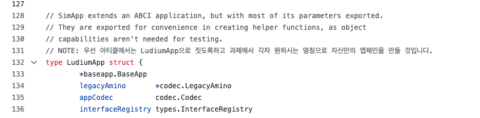
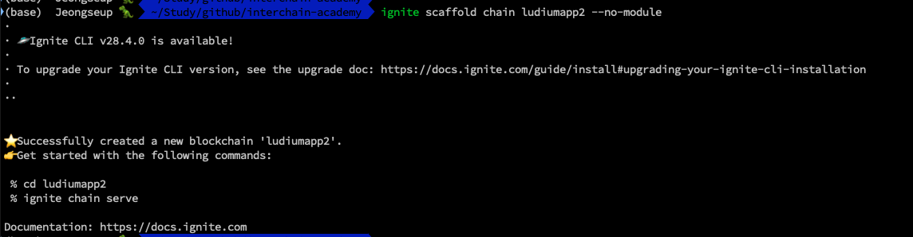
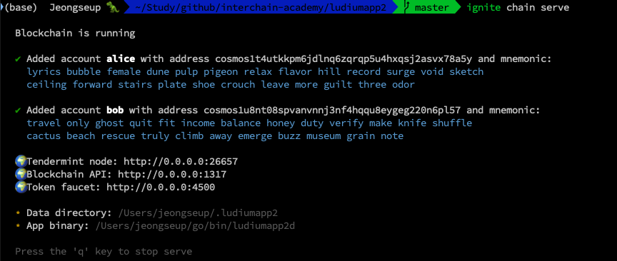

# 루디움 앱체인 만들기

### Preview

**Hello Earth 🌏!, Welcome to Cosmos 🌌**, 코스모스 베이직 과정 일곱번째 챕터에 온 걸 환영한다.

이제 우리는 simapp에 대해서 다 배웠다.
(박수 👏! 👏! 👏!)

이제 그럼 simapp과 유사한 간단한 어플리케이션 체인을 만들어보자.

이번 미션은 직접 코드 레벨로 copy & paste를 하면서 어디에 어떤 코드들이 있는지부터 하나씩 배우는 것이 의미있을 것 같아서 글보다는 대부분 직접 실습하고 Q&A를 갖는 것으로 대체하려고 한다.

바로 시작해보자!

### 1. Clone ludiumapp chain

먼저 [ludiumapp-chain repo](https://github.com/Ludium-Official/ludiumapp-chain)를 클론한다.

```bash
git clone https://github.com/Ludium-Official/ludiumapp-chain

cd ludiumapp-chain && git checkout 794d2ab2d1550d2f58b0a99708a40a5c34d9d92a

# 나중에 다룰 커스텀 모듈 때문에 브런치를 추가로 생성해놨으니, 체크아웃 귀찮은 사람은 아래를 참고바란다
# git clone https://github.com/Jeongseup/ludiumapp-chain.git -b 07-article
```

이후 아티클을 진행하기전에 이전에 배운 simapp과의 바뀐 코드구조에 간단히 대해서만 보고 지나가겠다.

우선 기존의 simapp의 code architecture이다.

비록 app.go만을 배웠으나 제일 중요한 건 app.go와 main application chain struct를 잘 이해해야 이후에 모듈을 커스텀하거나 모듈파트를 배울 때 어떻게 연결되는지 이해하는데 큰 도움이 되기 때문에 그렇다.

나머지 코드들은 많이 보고 익숙해지면 되는 부분이 때문에 생각한다.
(다만 아직 개발 자체가 미숙하신 분들을 위해서, 첨언을 하자면! root 경로에서 `<appchain-name>/cmd/main.go`에 기본적으로 main function에 대한 엔트리포인트 및 빌드되는 부분이란 것만 알아뒀으면 좋겠다)

#### simapp architecture

기존에 우리가 배웠던 simapp은 app.go 및 기타 application 관련된 코드들이 루트경로에 simapp이란 패키지로 아래와 같이 묶여있었다.

```sh
├── README.md
├── app.go
├── config.go
├── encoding.go
├── export.go
├── genesis.go
├── genesis_account.go
├── params
│   ├── amino.go
│   ├── doc.go
│   ├── encoding.go
│   ├── params.go
│   ├── proto.go
│   └── weights.go
├── simd
│   ├── cmd
│   │   ├── genaccounts.go
│   │   ├── root.go
│   └── main.go
├── state.go
├── types.go
├── upgrades.go
├── utils.go
```

#### ludiumapp chain

그래서 위의 코드들 중 어플리케이션 관련 파트들을 app directory로 몰아 넣어서 이 강의를 볼 개발자들이 좀 더 가시적으로 이해하기 쉽게 정도만 정리해보았다.

```sh
├── app
│   ├── app.go
│   ├── const.go
│   ├── default_app_methods.go
│   ├── encoding.go
│   ├── export.go
│   ├── genesis.go
│   ├── params
│   │   ├── config.go
│   │   ├── encoding.go
│   │   ├── params.go
│   │   └── proto.go
│   └── types
│       ├── address.go
│       ├── cointype.go
│       └── config.go
├── go.mod
├── go.sum
├── ludiumappd
│   ├── cmd
│   │   ├── app_creater.go
│   │   ├── genaccount.go
│   │   ├── query.go
│   │   ├── root.go
│   │   └── tx.go
│   └── main.go
```

그리고 아래와 같이 설명이 좀 필요한 부분에 `NOTE`라고 제가 한국어로 주석을 좀 달아놨다. 이해하는데 도움이 되길 바란다.


이제 클론 및 개인 레포를 하나 만들어서 카피코딩을 하는 시간을 갖자.
(과제로 제출해야하며, 따로 부연설명보다는 질문을 받는 것으로 해당 시간을 진행할 예정이다)

**참고사항**
참고로 이와 비슷한 형태로 simapp 구조를 정리해둔 이 [chain-minimal repository](https://github.com/cosmosregistry/chain-minimal)도 도움이 될 수 있어서 올려놓는다.

### 2. Start ludiumapp chain

클론을 했고 먼저 실행을 시켜보고 싶다면, README를 따라서 진행하시면 된다.

```bash
# install chain
make install

# init chain
./scripts/init.sh

# start chain
./scripts/start.sh
```


<!-- https://github.com/cosmosregistry/chain-minimal -->

### 3. Rebuild with ignite cli

마지막으로 다뤄볼 내용은 ignite라는 CLI tool로 이번 시간에 만들어본 ludiumapp을 다시 한번 만들어보는 것이다.

ignite는 cosmos-sdk 앱체인 개발자들을 위해서 보일러 플레이트가 되는 부분들을 scaffolding 형식으로 만들어주는 툴이다.

ignite를 이용한다면 보다 용이하게 앱체인을 개발할 수 있다.

다만, 처음부터 바로 해당 툴을 이용하지 않은 이유는 한꺼번에 너무 많은 것들이 만들어지기 때문에 각각의 컴포넌트에 대한 이해가 없는 상태에서 해당 툴은 오히려 더 복잡하게만 만들 것 같아서 사용하지 않았다.

그렇지만 이런 툴이 존재하고 이런 툴을 이용한다면 위에서 작업한 내용들을 어떻게 재현가능한지 정도만 간단히 다룰 예정이다.

ignite에 대한 좀 더 자세한 내용은 [official docs](https://docs.ignite.com/)를 참고하시면 좋을 것 같다.

#### install ignite cli

우리가 설치할 버젼은 v0.26.1 이다.

해당 버젼을 사용한 이유는 그나마 cosmos-sdk 버젼이 v0.45.4와 유사한 v0.46.x를 사용하기 때문이다.

```bash
# install ignite v0.26.1
curl https://get.ignite.com/cli@v0.26.1\! | bash

# check ignite version
ignite version
```

#### create a new ludiumapp2 with ignite

그리고 간단히 아래의 커맨드를 입력해주면 아래 사진과 같이 보일러 플레이트와 같은 기본 앱체인 구성을 제너레이팅 해준다. 저희는 이제 간단한 앱체인의 아키텍쳐 구성을 이해할 수 있으니 tree로 비슷한 지 체크해보자.

```bash
# create a new app chain
ignite scaffold chain ludiumapp2 --no-module

# >>> result
# % cd ludiumapp2
# % ignite chain serve
```



```sh
.
├── app
│   ├── app.go
│   ├── encoding.go
│   ├── export.go
│   ├── genesis.go
│   ├── params
│   │   └── encoding.go
│   └── simulation_test.go
├── cmd
│   └── ludiumapp2d
│   ├── cmd
│   │   ├── config.go
│   │   ├── genaccounts.go
│   │   └── root.go
│   └── main.go
├── config.yml
├── docs
│   ├── docs.go
│   ├── static
│   │   └── openapi.yml
│   └── template
│   └── index.tpl
├── go.mod
├── go.sum
├── readme.md
├── testutil
│   ├── network
│   │   └── network.go
│   ├── nullify
│   │   └── nullify.go
│   └── sample
│   └── sample.go
└── tools
└── tools.go

```

#### start ludiumapp2 chain

끝으로 간단히 제너레이팅된 체인이 제대로 동작하는 체크하기 위한 테스트로 chain을 가동시켜보자.

```bash
# serve our chain
ignite chain serve
```


