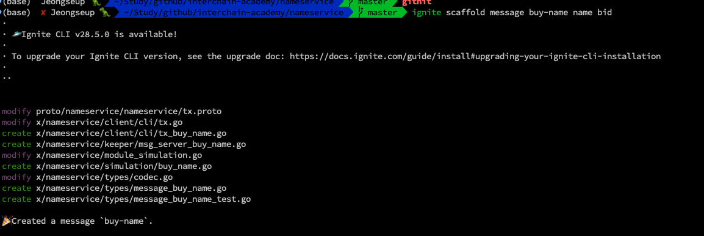

# 이그나이트로 네임서비스 체인 만들기

### Preview

**Hello Earth 🌏!, Welcome to Cosmos 🌌**, 코스모스 베이직 과정 여덟번째 챕터에 온 걸 환영한다.

지난 시간 마지막에는 이그나이트를 배웠다.

원래는 다음 파트인 트랜잭션 및 쿼리, 그리고 store, keeper등과 같은 것들과 cosmos-sdk module에 대해서 배우고 custom module이 들어간 앱체인들 빌드해보는 것이 순서일 수도 있지만

예습과 복습의 효과를 통해서 더 많이 배울수 있도록 하기 위해 간단히 이그나이를 사용하면서 모듈을 만드는 이 아티클을 준비했다.

다시 한번 말하지만, **이번 아티클은 이해하려고 하지말고 기존에 배웠던 simapp과 ludiumapp 같은 minimal appchain에 어떻게 모듈이 추가되어지는지 하나의 모듈을 추가하기 위해서 어떤 것들 작업하고 배워야하는지를 훑어보는 시간이라고 생각하면 된다.**

지금은 우선 이그나이트로 네임서비스 체인을 빠르게 빌드하는 것을 보자.

(이번 아티클은 굳이 따라하지 않아도 되는 아티클이다 강의를 보는 것만으로도 충분히 효과가 있을 것이라 사려된다)

### 1. Create a nameservice chain without any module

먼저 우리가 배워왔던 대로 아무런 모듈이 없는 미니멀한 상태로 앱체인을 하나 generate한다.

```bash
# create empty chain
# how to use? : ignite scaffold chain <chain-name> --no-module
ignite scaffold chain nameservice --no-module

# change directory into nameservice chain
cd nameservice
```

### 2. Add a new module, nameservice

그럼 이제 nameservice라는 커스텀 모듈을 추가해보자.

nameservice application chain은 유저들이 토큰으로 name을 사고 파는 간단히 모듈로 만들 예정이다.

아래 명령을 이용해서, basic 모듈들과 같이 x라는 directory 밑에 nameservice모듈을 추가했다.

플래그는 토큰 전송을 위해 bank 모듈과의 디펜던시가 필요하다는 것을 의미한다.

그럼 같이 결과를 보자.

```bash
# add namespace module with bank module dependency
ignite scaffold module nameservice --dep bank
```


무언가 많이 생성되었는데, 앱체인의 x directory밑에 생성된 nameservice 모듈의 구조는 다음과 같다.

```sh
└── x
└── nameservice
├── client
│   └── cli
│   ├── query.go
│   ├── query_params.go
│   └── tx.go
├── genesis.go
├── genesis_test.go
├── keeper
│   ├── keeper.go
│   ├── msg_server.go
│   ├── msg_server_test.go
│   ├── params.go
│   ├── params_test.go
│   ├── query.go
│   ├── query_params.go
│   └── query_params_test.go
├── module.go
├── module_simulation.go
├── simulation
│   └── helpers.go
└── types
├── codec.go
├── errors.go
├── expected_keepers.go
├── genesis.go
├── genesis.pb.go
├── genesis_test.go
├── keys.go
├── params.go
├── params.pb.go
├── query.pb.go
├── query.pb.gw.go
├── tx.pb.go
└── types.go
```

여기서 중요한 점은 사실 모듈보다는 proto directory 이다.

기본적으로 어떤 모듈을 만들기 위해서는 어떤 데이터를 주고 받을지를 정의해야한다. 아래와 같이 말이다.

proto가 익숙하지 않은 사람들은 그냥 json formatting이라고 생각해도 좋다.

다만 어떤 메세지를 주고 받을지 proto에서 정의하고 그에 따라서 해당 메세지를 CRUD하거나 Query하기 위해 각각 `*.proto`를 생성하게 되고 이에 따라서 `x/module/*.go` 파일들을 generate하게 되는 것이라고만 알아두자
(어차피 protobuf에 관한 [아티클](./25.Protobuf.md)이 준비되어있으니 나중에 배워도 충분하다)

**그렇기 때문에 실제로 앱체인 개발자들이 주로 다루는 언어는 golang이지만 실제 비즈니스 로직을 짠 이후 가장 먼저 정의해야할 것이 데이터 구조이고**

해당 데이터구조에 따라서 `message-name.proto`를 생성하게 된다.

```proto
message Whois {
  string index = 1;
  string name = 2;
  string value = 3;
  string price = 4;
  string owner = 5;

}
```

이번에도 역시나 간단히 디렉토리 구조만 보고 지나가보자.

```sh
── proto
│   └── nameservice
│   └── nameservice
│   ├── genesis.proto
│   ├── params.proto
│   ├── query.proto
│   └── tx.proto
```

### 3. Add messages for nameservice module

우선 자세한 비즈니스 로직은 생략하고

우리가 nameservice module에서 생성할 메세지는 총 3개로 BuyName, SetName, DeleteName인 것만 보고 지나가자.

여기서 중요한 점은 **각 메세지들은 Cosmos-SDK에서 정의한 `Msg` interface 타입을 준수하며**

이는 proto.Message를 확장하고 다음 메서드와 레거시 메서드(Type, Route, GetSignBytes)를 포함하게 된다는 것이다.

각 메세지들이 Msg를 준수해야하는 이유는 Cosmos-SDK는 메시지를 트랜잭션에서 래핑 및 언래핑하므로, 애플리케이션 개발자는 메시지만 정의하면 되기 때문이다.

- BuyName: 이름을 구매한다
- SetName: 이름에 값을 설정한다
- DeleteName: 이름을 삭제한다

```go
// https://docs.ignite.com/v0.25/guide/nameservice/messages
// Transactions messages must fulfill the Msg interface
type Msg interface {
    proto.Message

    // ValidateBasic does a simple validation check that
    // doesn't require access to any other information.
    ValidateBasic() error

    // Signers returns the addrs of signers that must sign.
    // CONTRACT: All signatures must be present to be valid
    GetSigners() []AccAddress

    // Legacy methods
    // NOTE: 커스텀 모듈을 빌드해보는 시간에 다시 다뤄지니 걱정 말자.
    Type() string
    Route() string
    GetSignBytes() []byte
}

```

모듈에 필요한 메세지는 ignite를 통해서 이렇게 scaffolding해서 만들어낼 수 있다.

```bash
# add messages
ignite scaffold message buy-name name bid

ignite scaffold message set-name name value

ignite scaffold message delete-name name
```




### 4. Implement messages

그리고 각 메세지마다 nameservice 어플리케이션 비즈니스 로직에 따라서 각 메세지 부분들을 채워주면 모듈 개발이 끝난다.
**(중요한 건 잘 코딩하는게 아니라, 비즈니스 로직을 잘 구성하는 것이다. 개발 이전에 어떻게 로직을 만들지 각자 A4나 스케치해보고 개발하는 과정을 가지면 좋겠다)**

이 파트는 당장에 중요하지 않으니, 이 [링크](https://github.com/Jeongseup/nameservice-chain/commit/5bae53103ad4db8fc93b473b43ffa93a7e68dfb1)를 통해서 대체한다.

그리고 끝으로 다 만들 nameservice 체인을 play 해보고 싶다면 [이 문서](https://docs.ignite.com/v0.25/guide/nameservice/play)를 따라서 테스트러닝을 해볼 수 있지만 이것 역시 생략한다.

### 5. End

이번 아티클은 실습의 과정이 아닌 보기만 하는 아티클이다.

개인적으로 보는 것만으로도 앞으로 배울 것들이 어떤 것을 목적으로 배우냐에 대한 동기부여와 예복습이 충분히 이뤄질 수 있다고 생각한다.
(누누이 말하지만 익!숙! 해져야 그 다음에 이해가 되니 이해하려고 하지 말라)

이번 아티클을 통해, 앞으로 각 모듈과 모듈과 인터랙팅하는 것들과 추후 커스텀 모듈을 위와 같이 만들고 지난 시간에 만든 우리의 앱체인에 integration할 때에 좀 더 쉽게 이해할 수 있게 될 것이다.

그렇지만 해당 과정이 각각 궁금하신 분들은 아래의 제 레포에 각 커밋별로 어떤 코드들이 추가되었고 수정되었는 보셔도 좋다.
(충분히 많은 공부가 될 것이다 시간적 여유가 있다면 모든 아티클을 끝내고 다시 이 아티클로 돌아와서 복습하는 것도 좋은 방법이되겠다)

가장 중요한 점은

1. 하나의 모듈이 구성되는데 있어서 `proto` directory에 해당 모듈이 필요로 하는 메세지의 데이터 구조를 비즈니스로직에 맞춰 구성한다는 점과
2. 해당 메세지를 CRUD & Query 하기 위해 `tx.proto`, `query.proto`를 구현한다는 점
3. 마지막으로 잘 만들어둔 proto directory를 통해서 `x/module/*.go`에 필요한 여러 파일들을 generate하게 된다는 점을 이해하면 된다.

**tx.proto는 protobuf code generator를 통해서 tx.pb.go로 generating 됩니다. 아래는 샘플이다.**

```go
// https://github.com/Jeongseup/nameservice-chain/blob/5bae53103ad4db8fc93b473b43ffa93a7e68dfb1/x/nameservice/types/tx.pb.go
// Code generated by protoc-gen-gogo. DO NOT EDIT.
// source: nameservice/nameservice/tx.proto

// some codes..
```

#### References

- https://docs.ignite.com/v0.25/guide/nameservice
- https://github.com/Jeongseup/nameservice-chain/commits/main/
