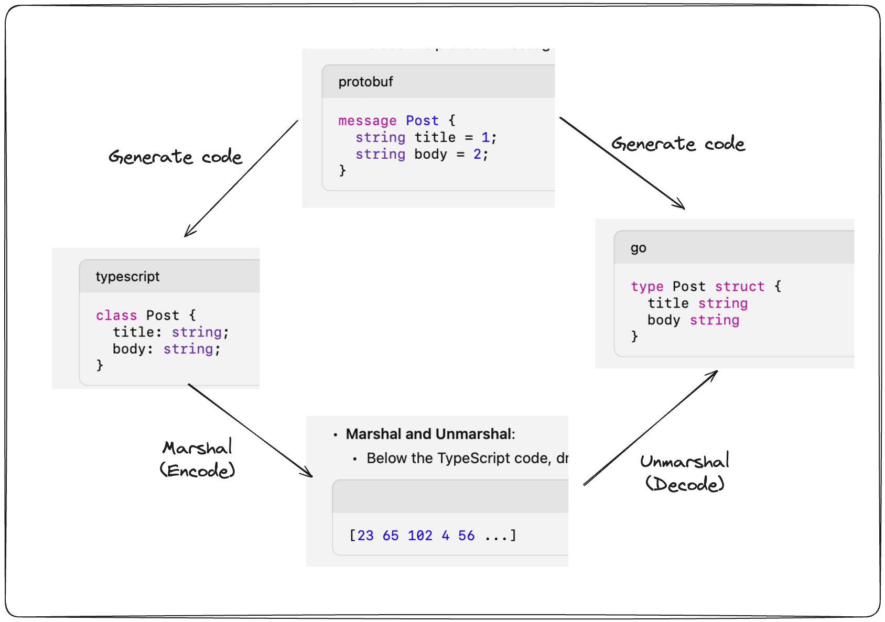

# Protobuf

### Preview

**Hello World!** 안녕하세요! 코스모스 베이직 과정 모듈 챕터에 오신 것을 환영합니다. 이번에 다룰 주제는 `Protocol Buffers`입니다. cosmos-sdk와 모듈 얘기를 하다가 갑자기 왜 `Protobuf`를 설명하는 건지 의아해하실 수도 있겠지만 해당 코덱을 sdk에서 차용해서 쓰고 있기 때문에 그렇습니다. 그리고 sdk과 별개로 최근들어 json기반의 REST API가 아닌 protobuf기반의 GRPC API를 만드는 팀들도 있으니 개발관점에서도 도움이 될 것입니다.

---

### Background of Protobuf

구글에서 개발한 `Protocol Buffers`(protobuf)는 데이터를 구조화하고 전송하는 데 최적화된 바이너리 직렬화 포맷입니다. JSON이나 XML과 같은 텍스트 기반의 데이터 포맷은 사람이 읽기 쉽고 이해하기 쉽지만, 데이터 전송 및 처리 성능에서는 한계가 있습니다. 이러한 한계를 극복하기 위해 구글은 성능과 효율성을 극대화할 수 있는 포맷을 만들기 위해 Protocol Buffers를 개발하게 되었습니다.

---

### Comparison with JSON Data Format

JSON 데이터 포맷은 사람이 읽기 쉽고, 웹에서 널리 사용되는 텍스트 기반의 데이터 포맷입니다. 그러나 JSON은 데이터의 크기와 처리 성능 면에서 비효율적일 수 있습니다. 반면, Protocol Buffers는 바이너리 포맷으로 데이터를 직렬화하여 전송하기 때문에 크기가 작고 처리 속도가 약 6배정도 빠르다고 합니다.(아래 레퍼런스 참고)

JSON과 Protobuf 메시지는 상호 교환할 수 있지만, 이 두 기술은 다른 목표를 가지고 설계되었습니다. JSON은 텍스트 형식의 메시지 포맷이며, 거의 모든 프로그래밍 언어에서 지원됩니다. 반면, Protobuf는 메시지 포맷뿐만 아니라 메시지를 정의하고 교환하는 규칙까지도 세트입니다. 구글은 이 Protobuf를 오픈 소스로 제공하고, JavaScript, Java, PHP, C#, Ruby, Objective C, Python, C++, Go 등 다양한 언어용 코드 생성 도구를 제공합니다. 또한, Protobuf는 JSON보다 더 많은 데이터 유형과 메소드를 가지며, RPC(원격 프로시저 호출)에서 많이 사용됩니다.



그렇다면, 기왕 protobuf에 대해 배우게 되었으니 간단히 특장점을 살펴봅시다.

### Protobuf 특장점

- **읽기 및 쓰기 속도**: Protobuf는 JSON보다 읽기 및 쓰기 속도가 빠릅니다.
- **데이터 크기**: 바이너리 형식인 Protobuf는 JSON보다 데이터 크기가 작습니다.
- **스키마**: Protobuf는 명확한 스키마를 통해 데이터 구조를 정의하며, 이는 데이터의 일관성과 무결성을 유지하는 데 도움이 됩니다.
- **확장성**: Protobuf는 하위 호환성을 보장하며, 새로운 필드를 추가하더라도 기존 클라이언트와의 호환성을 유지할 수 있습니다.

private API 나 클라이언트를 통제할 수 있으면 JSON 보다 더 나은 데이터 구조화와 전송 방식일 수도 있습니다. 이런 protocol Buffers(protobuf)는 구글에서 만들었고 언어와 플랫폼에 상관없이 쓸 수 있고 확장가능합니다.

위와 같은 특징들 때문에 그래서 rpc framework를 만들 때 구글에서 이 좋은 데이터 형식을 가지고 gRPC에 protobuf를 차용합니다. 이런 protobuf 메세지는 직접 코드를 짜지 않고 `*.proto`란 파일로서 정의합니다.

```proto
syntax = "proto3";

package Lecture;

message Class {
    string name = 1 ;
}
```

더 자세한 내용은 아래의 공식문서를 통해서 확인해보시길 바랍니다.

https://protobuf.dev/

---

### gogoprotobuf compiler

추가로 각 언어마다 있는지는 정확히 모르겠지만, 저희가 다루는 golang에 있어서는 gogoprotobuf라는 확장된 버젼의 컴파일러가 존재합니다. 여기서 말하는 컴파일러란 위에서 말했다시피 각 언어를 지원시 프로토메세지를 각 언어에 맞게 generating해주는 컴파일러를 뜻합니다.

gogoprotobuf란 원래 공식으로 존재했던 google에서 만든 컴파일러를 개선한 버젼입니다. 해당 히스토리는 구글의 Go팀과 protobuf팀이 같이 먼저 런타임을 만들었는데, 외부 팀이 이를 포크해서 더 빠른 gogoprotobuf를 개발하므로써 등장하게 되었습니다.

다만, 이후에 2020년 3월쯤 Go팀은 프로토콜 버퍼를 위해서 성능 향상한 Go API(APIv2)라는 메이저 버젼과 gogoprotobuf 처럼 reflection API를 배포함. 그렇기 때문에 요즘엔 그냥 [golang protobuf(APIv2)](https://github.com/golang/protobuf)를 사용하는 것이 났다고 합니다.

현재 [gogoprotobuf은 오너쉽 이슈 때문에 관리가 안되는 것 같습니다.](https://github.com/gogo/protobuf/issues/691)


그렇지만 종종 개발 커뮤니티에서 어떤 컴파일러를 쓸지 [이와 같이](https://www.reddit.com/r/golang/comments/oy0ob1/which_protobuf_compiler_to_choose/) 거론되기도 합니다.

---

### gogoprotobuf in cosmos-sdk

생각보다 좀 장황했던 이번 아티클을 소개한 이유는 바로 cosmos-sdk에서 코덱으로써 현재 protobuf를 사용하고 있기 때문이입니다. 초기에 코스모스에서는 위에서 말씀드린 gogoprotobuf 컴파일을 사용하였습니다.

때문에 종종 v0.45.4 버젼에서 만든 저희 ludiumapp chain의 go.mod에는 replace가 되어있는 것을 보실 수 있습니다.

```go
https://github.com/regen-network/protobuf/tree/v1.3.3-alpha.regen.1
```

그리고 유지보수의 문제로 인해 cosmos v0.47.x 이후 부터는 유지보수의 문제로 따로 cosmos쪽에서 포크된 [레포](https://github.com/cosmos/gogoproto?tab=readme-ov-file)로서 관리합니다.

> Migration from gogo/protobuf to cosmos/gogoproto. The SDK was using the now unmaintained gogo/protobuf library. This has been replaced by cosmos/gogoproto which is a fork of gogo/protobuf with some improvements and fixes, that is maintained by the Cosmos SDK team. This change is not transparent for applications developers. All proto files should be regenerated with the new library. Use the ghcr.io/cosmos/proto-builder image (version >= 0.11.5) for generating protobuf files.

#### References

- https://auth0.com/blog/beating-json-performance-with-protobuf/

- https://github.com/orgs/cosmos/discussions/6

- https://github.com/cosmos/gogoproto?tab=readme-ov-file
